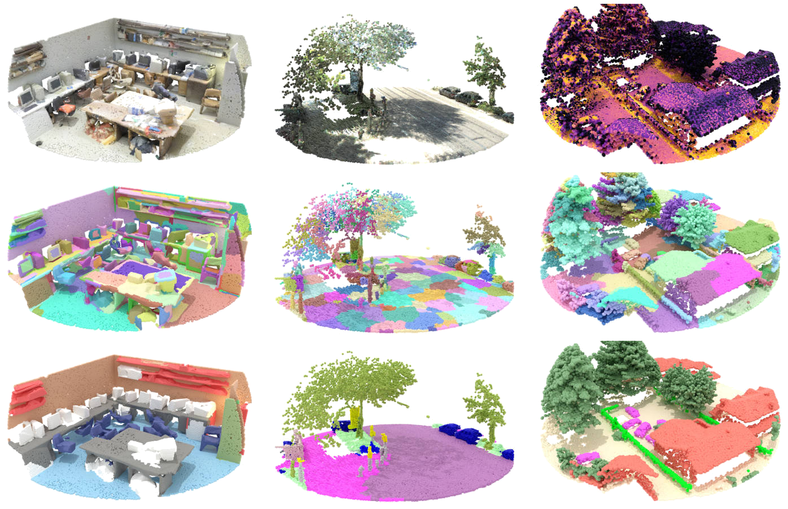
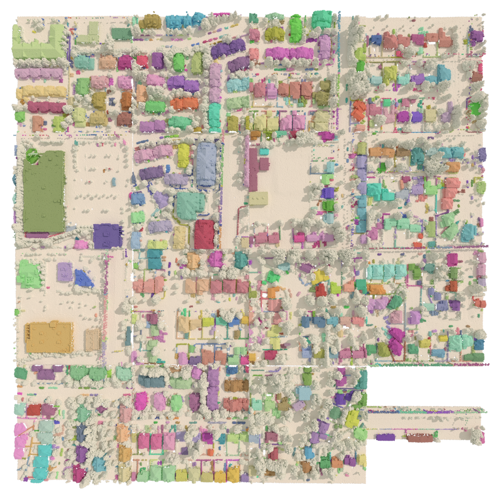

<div align="center">

# Superpoint Transformer

[](https://github.com/pre-commit/pre-commit)
[](https://pytorch.org/get-started/locally/)
[](https://pytorchlightning.ai/)
[](https://hydra.cc/)
[](https://github.com/ashleve/lightning-hydra-template#license)

[//]: # ([![Paper]&#40;https://img.shields.io/badge/paper-arxiv.1001.2234-B31B1B.svg&#41;]&#40;https://www.nature.com/articles/nature14539&#41;)
[//]: # ([![Conference]&#40;https://img.shields.io/badge/AnyConference-year-4b44ce.svg&#41;]&#40;https://papers.nips.cc/paper/2020&#41;)


Official implementation for
<br>
<br>
[_Efficient 3D Semantic Segmentation with Superpoint Transformer_](https://arxiv.org/abs/2306.08045) (ICCV 2023)
<br>
[](https://arxiv.org/abs/2306.08045)
[](https://doi.org/10.5281/zenodo.8042712)
[](https://drprojects.github.io/superpoint-transformer)
[](https://www.youtube.com/watch?v=2qKhpQs9gJw)
<br>
<br>
[_Scalable 3D Panoptic Segmentation As Superpoint Graph Clustering_](https://arxiv.org/abs/2401.06704) (3DV 2024 Oral)
<br>
[](https://arxiv.org/abs/2401.06704)
[](https://doi.org/10.5281/zenodo.10689037)
[](https://drprojects.github.io/supercluster)
<br>
<br>
[_EZ-SP: Fast and Lightweight Superpoint-Based 3D Segmentation_](https://arxiv.org/abs/2512.00385) (arXiv)
<br>
[](https://arxiv.org/abs/2512.00385)
[](https://doi.org/10.5281/zenodo.17642503)
[](https://louisgeist.github.io/ez-sp/)
<br>
**If you ❤️ or simply use this project, don't forget to give the repository a ⭐,
it means a lot to us !**
<br>
</div>


<br>

## 📌  Description

### Superpoint Transformer

<p align="center">
  
</p>

**Superpoint Transformer (SPT)** is a superpoint-based transformer 🤖 architecture that efficiently ⚡ 
performs **semantic segmentation** on large-scale 3D scenes. This method includes a 
fast algorithm that partitions 🧩 point clouds into a hierarchical superpoint 
structure, as well as a self-attention mechanism to exploit the relationships 
between superpoints at multiple scales. 

<div align="center">

|                                                                                   ✨ SPT in numbers ✨                                                                                      |
|:-----------------------------------------------------------------------------------------------------------------------------------------------------------------------------------------:|
|                                                                          📊 **S3DIS 6-Fold** (76.0 mIoU)                                                                          |
|                                                                         📊 **KITTI-360 Val** (63.5 mIoU)                                                                          |
|                                                                           📊 **DALES** (79.6 mIoU)                                                                           | 
|      🦋 **212k parameters** ([PointNeXt](https://github.com/guochengqian/PointNeXt) ÷ 200, [Stratified Transformer](https://github.com/dvlab-research/Stratified-Transformer) ÷ 40)       | 
| ⚡ S3DIS training in **3h on 1 GPU** ([PointNeXt](https://github.com/guochengqian/PointNeXt) ÷ 7, [Stratified Transformer](https://github.com/dvlab-research/Stratified-Transformer) ÷ 70) | 
|                                                  ⚡ **Preprocessing x7 faster than [SPG](https://github.com/loicland/superpoint_graph)**                                                   |

[](https://paperswithcode.com/sota/3d-semantic-segmentation-on-s3dis?p=efficient-3d-semantic-segmentation-with-1)
[](https://paperswithcode.com/sota/3d-semantic-segmentation-on-dales?p=efficient-3d-semantic-segmentation-with-1)
[](https://paperswithcode.com/sota/semantic-segmentation-on-s3dis?p=efficient-3d-semantic-segmentation-with-1)
[](https://paperswithcode.com/sota/3d-semantic-segmentation-on-kitti-360?p=efficient-3d-semantic-segmentation-with-1)
</div>

### SuperCluster

<p align="center">
  
</p>

**SuperCluster** is a superpoint-based architecture for **panoptic segmentation** of (very) large 3D scenes 🐘 based on SPT. 
We formulate the panoptic segmentation task as a **scalable superpoint graph clustering** task. 
To this end, our model is trained to predict the input parameters of a graph optimization problem whose solution is a panoptic segmentation 💡.
This formulation allows supervising our model with per-node and per-edge objectives only, circumventing the need for computing an actual panoptic segmentation and associated matching issues at train time.
At inference time, our fast parallelized algorithm solves the small graph optimization problem, yielding object instances 👥.
Due to its lightweight backbone and scalable formulation, SuperCluster can process scenes of unprecedented scale at once, on a single GPU 🚀, with fewer than 1M parameters 🦋.

<div align="center">

|                               ✨ SuperCluster in numbers ✨                                |
|:----------------------------------------------------------------------------------------:|
|                        📊 **S3DIS 6-Fold** (55.9 PQ)                                     |
|                              📊 **S3DIS Area 5** (50.1 PQ)                               |
|                               📊 **ScanNet Val** (58.7 PQ)                               |
|                              📊 **KITTI-360 Val** (48.3 PQ)                              |
|                                  📊 **DALES** (61.2 PQ)                                  |
| 🦋 **212k parameters** ([PointGroup](https://github.com/dvlab-research/PointGroup) ÷ 37) |
|                           ⚡ S3DIS training in **4h on 1 GPU**                            | 
|              ⚡ **7.8km²** tile of **18M** points in **10.1s** on **1 GPU**               |

[](https://paperswithcode.com/sota/panoptic-segmentation-on-s3dis?p=scalable-3d-panoptic-segmentation-with)
[](https://paperswithcode.com/sota/panoptic-segmentation-on-s3dis-area5?p=scalable-3d-panoptic-segmentation-with)
[](https://paperswithcode.com/sota/panoptic-segmentation-on-scannetv2?p=scalable-3d-panoptic-segmentation-with)
[](https://paperswithcode.com/sota/panoptic-segmentation-on-kitti-360?p=scalable-3d-panoptic-segmentation-with)
[](https://paperswithcode.com/sota/panoptic-segmentation-on-dales?p=scalable-3d-panoptic-segmentation-with)

</div>

### EZ-SP (Easy Superpoints)

<p align="center">
  
</p>

**EZ-SP** brings two main improvements over SPT:
- Much faster preprocessing and inference
- Easier and learnable parametrization of the partition

EZ-SP replaces the costly, CPU-based, cut-pursuit partitioning step of SPT 
with a **fast and learnable GPU-based partitioning**. 
First, we train a small convolutional backbone to embed each point of the input 
scene into a low-dimensional space, where adjacent points from different 
semantic classes are pushed apart. 
Next, our new GPU-accelerated graph clustering algorithm groups neighboring 
points with similar embeddings, while encouraging simple cluster contours, thus
produces semantically homogeneous superpoints.
These superpoints can then be used in the SPT semantic segmentation framework.

<div align="center">

|                                         ✨ EZ-SP in numbers ✨                                         |
|:----------------------------------------------------------------------------------------------------:|
|                                   📊 **S3DIS 6-Fold** (76.1 mIoU)                                    |
|                                   📊 **S3DIS Area 5** (69.6 mIoU)                                    |
|                                   📊 **KITTI-360 Val** (62.0 mIoU)                                   |
|                              📊 **DALES** (79.4 mIoU)                                                |
|                                        🦋 **392k parameters**                                        |
| ⚡️ **72×** faster than [PTv3](https://arxiv.org/abs/2312.10035) for end-to-end semantic segmentation |
|                   ⚡️ **5.3x** faster than SPT for end-to-end semantic segmentation                   | 


</div>


## 📰  Updates
- **27.11.2025** Major code release for our **learnable, GPU-accelerated 
partition**, implementing 
[_**EZ-SP: Fast and Lightweight Superpoint-Based 3D Segmentation**_](https://arxiv.org/abs/%3CARXIV%20PAPER%20ID%3E).
This new version introduces some changes to the codebase which are 
**non-backward compatible**.
We strived to document the breaking changes and provide **instructions and
scripts** to help users of previous versions move to the new codebase.
Please refer to the [**CHANGELOG**](CHANGELOG.md) for more details❗
- **27.06.2024** Released our Superpoint Transformer 🧑‍🏫 tutorial 
[slides](media/superpoint_transformer_tutorial.pdf), 
[notebook](notebooks/superpoint_transformer_tutorial.ipynb), and [video](https://www.youtube.com/watch?v=2qKhpQs9gJw). 
Check these out if you are getting started with the project ! 
- **21.06.2024** [Damien](https://github.com/drprojects) will be giving a 
**🧑‍🏫 tutorial on Superpoint Transformer on 📅 27.06.2024 at 1pm CEST**. 
Make sure to come if you want to gain some hands-on experience with the project !
**[Registration here](https://www.linkedin.com/events/superpointtransformersfor3dpoin7209130538110963712)**. 
- **28.02.2024** Major code release for **panoptic segmentation**, implementing 
**[_Scalable 3D Panoptic Segmentation As Superpoint Graph Clustering_](https://arxiv.org/abs/2401.06704)**.
This new version also implements long-awaited features such as lightning's
`predict()` behavior, **voxel-resolution and full-resolution prediction**.
Some changes in the dependencies and repository structure are **not 
backward-compatible**. If you were already using anterior code versions, this
means we recommend re-installing your conda environment and re-running the 
preprocessing or your datasets❗
- **15.10.2023** Our paper **[_Scalable 3D Panoptic Segmentation As Superpoint Graph Clustering_](https://arxiv.org/abs/2401.06704)** was accepted for an **oral** presentation at **[3DV 2024](https://3dvconf.github.io/2024/)** 🥳
- **06.10.2023** Come see our poster for **[_Efficient 3D Semantic Segmentation with Superpoint Transformer_](https://arxiv.org/abs/2306.08045)** at **[ICCV 2023](https://iccv2023.thecvf.com/)**
- **14.07.2023** Our paper **[_Efficient 3D Semantic Segmentation with Superpoint Transformer_](https://arxiv.org/abs/2306.08045)** was accepted at **[ICCV 2023](https://iccv2023.thecvf.com/)** 🥳
- **15.06.2023** Official release 🌱

<br>

## 💻  Environment requirements
This project was tested with:
- Linux OS
- **64G** RAM
- NVIDIA GTX 1080 Ti **11G**, NVIDIA V100 **32G**, NVIDIA A40 **48G**
- CUDA 11.8 and 12.1
- conda 23.3.1

<br>

## 🏗  Installation
Simply run [`install.sh`](install.sh) to install all dependencies in a new 
conda environment named `spt`. 
```bash
# Creates a conda env named 'spt' env and installs dependencies
./install.sh
```

**Optional dependency**: [TorchSparse](https://github.com/mit-han-lab/torchsparse) 
is an optional dependency that enables sparse 3D convolutions, used in the 
EZ-SP models. To install an environment with this, use:
```bash
# Creates a conda env named 'spt' env and installs all dependencies + TorchSparse
./install.sh with_torchsparse
```


> **Note**: See the [Datasets page](docs/datasets.md) for setting up your dataset
> path and file structure.

<br>

### 🔩  Project structure
```
└── superpoint_transformer
    │
    ├── configs                   # Hydra configs
    │   ├── callbacks                 # Callbacks configs
    │   ├── data                      # Data configs
    │   ├── debug                     # Debugging configs
    │   ├── experiment                # Experiment configs
    │   ├── extras                    # Extra utilities configs
    │   ├── hparams_search            # Hyperparameter search configs
    │   ├── hydra                     # Hydra configs
    │   ├── local                     # Local configs
    │   ├── logger                    # Logger configs
    │   ├── model                     # Model configs
    │   ├── paths                     # Project paths configs
    │   ├── trainer                   # Trainer configs
    │   │
    │   ├── eval.yaml                 # Main config for evaluation
    │   └── train.yaml                # Main config for training
    │
    ├── data                      # Project data (see docs/datasets.md)
    │
    ├── docs                      # Documentation
    │
    ├── logs                      # Logs generated by hydra and lightning loggers
    │
    ├── media                     # Media illustrating the project
    │
    ├── notebooks                 # Jupyter notebooks
    │
    ├── scripts                   # Shell scripts
    │
    ├── src                       # Source code
    │   ├── data                      # Data structure for hierarchical partitions
    │   ├── datamodules               # Lightning DataModules
    │   ├── datasets                  # Datasets
    │   ├── dependencies              # Compiled dependencies
    │   ├── loader                    # DataLoader
    │   ├── loss                      # Loss
    │   ├── metrics                   # Metrics
    │   ├── models                    # Model architecture
    │   ├── nn                        # Model building blocks
    │   ├── optim                     # Optimization 
    │   ├── transforms                # Functions for transforms, pre-transforms, etc
    │   ├── utils                     # Utilities
    │   ├── visualization             # Interactive visualization tool
    │   │
    │   ├── eval.py                   # Run evaluation
    │   └── train.py                  # Run training
    │
    ├── tests                     # Tests of any kind
    │
    ├── .env.example              # Example of file for storing private environment variables
    ├── .gitignore                # List of files ignored by git
    ├── .pre-commit-config.yaml   # Configuration of pre-commit hooks for code formatting
    ├── install.sh                # Installation script
    ├── LICENSE                   # Project license
    └── README.md

```

> **Note**: See the [Datasets page](docs/datasets.md) for further details on `data/`. 

> **Note**: See the [Logs page](docs/logging.md) for further details on `logs/`. 

<br>

## 🚀  Usage
### Datasets
See the [Datasets page](docs/datasets.md) to set up your datasets. 

### Evaluation
Use the following command structure for evaluating our models from a checkpoint 
file `checkpoint.ckpt`, where `<task>` should be `semantic` for using SPT and `panoptic` for using 
SuperCluster:

```bash
# Evaluate for <task> segmentation on <dataset>
python src/eval.py experiment=<task>/<dataset> ckpt_path=/path/to/your/checkpoint.ckpt
```

Some examples:

```bash
# Evaluate SPT on S3DIS Fold 5
python src/eval.py experiment=semantic/s3dis datamodule.fold=5 ckpt_path=/path/to/your/checkpoint.ckpt

# Evaluate SPT on KITTI-360 Val
python src/eval.py experiment=semantic/kitti360  ckpt_path=/path/to/your/checkpoint.ckpt 

# Evaluate SPT on DALES
python src/eval.py experiment=semantic/dales ckpt_path=/path/to/your/checkpoint.ckpt

# Evaluate SuperCluster on S3DIS Fold 5
python src/eval.py experiment=panoptic/s3dis datamodule.fold=5 ckpt_path=/path/to/your/checkpoint.ckpt

# Evaluate SuperCluster on S3DIS Fold 5 with {wall, floor, ceiling} as 'stuff'
python src/eval.py experiment=panoptic/s3dis_with_stuff datamodule.fold=5 ckpt_path=/path/to/your/checkpoint.ckpt

# Evaluate SuperCluster on ScanNet Val
python src/eval.py experiment=panoptic/scannet ckpt_path=/path/to/your/checkpoint.ckpt

# Evaluate SuperCluster on KITTI-360 Val
python src/eval.py experiment=panoptic/kitti360  ckpt_path=/path/to/your/checkpoint.ckpt 

# Evaluate SuperCluster on DALES
python src/eval.py experiment=panoptic/dales ckpt_path=/path/to/your/checkpoint.ckpt

# Evaluate EZ-SP on DALES
python src/eval.py experiment=semantic/dales_ezsp ckpt_path=/path/to/your/checkpoint.ckpt datamodule.pretrained_cnn_ckpt_path=/path/to/your/partition_checkpoint.ckpt
```

> **Note**: 
> 
> The pretrained weights of the **SPT** and **SPT-nano** models for 
>**S3DIS 6-Fold**, **KITTI-360 Val**, and **DALES** are available at:
>
> [](https://doi.org/10.5281/zenodo.8042712)
> 
> The pretrained weights of the **SuperCluster** models for 
>**S3DIS 6-Fold**, **S3DIS 6-Fold with stuff**, **ScanNet Val**, **KITTI-360 Val**, and **DALES** are available at:
>
> [](https://doi.org/10.5281/zenodo.10689037)
>
> The pretrained weights of the **EZ-SP** models for **S3DIS 6-Fold**, **KITTI-360 Val**, and **DALES** are available at:
>
> [](https://doi.org/10.5281/zenodo.17642503)

### Training
#### SPT & SuperCluster
Use the following command structure for **train our models on a 32G-GPU**, 
where `<task>` should be `semantic` for using SPT and `panoptic` for using 
SuperCluster:

```bash
# Train for <task> segmentation on <dataset>
python src/train.py experiment=<task>/<dataset>
```

Some examples:

```bash
# Train SPT on S3DIS Fold 5
python src/train.py experiment=semantic/s3dis datamodule.fold=5

# Train SPT on KITTI-360 Val
python src/train.py experiment=semantic/kitti360 

# Train SPT on DALES
python src/train.py experiment=semantic/dales

# Train SuperCluster on S3DIS Fold 5
python src/train.py experiment=panoptic/s3dis datamodule.fold=5

# Train SuperCluster on S3DIS Fold 5 with {wall, floor, ceiling} as 'stuff'
python src/train.py experiment=panoptic/s3dis_with_stuff datamodule.fold=5

# Train SuperCluster on ScanNet Val
python src/train.py experiment=panoptic/scannet

# Train SuperCluster on KITTI-360 Val
python src/train.py experiment=panoptic/kitti360 

# Train SuperCluster on DALES
python src/train.py experiment=panoptic/dales
```

Use the following to **train on a 11G-GPU 💾** (training time and performance 
may vary):

```bash
# Train SPT on S3DIS Fold 5
python src/train.py experiment=semantic/s3dis_11g datamodule.fold=5

# Train SPT on KITTI-360 Val
python src/train.py experiment=semantic/kitti360_11g 

# Train SPT on DALES
python src/train.py experiment=semantic/dales_11g

# Train SuperCluster on S3DIS Fold 5
python src/train.py experiment=panoptic/s3dis_11g datamodule.fold=5

# Train SuperCluster on S3DIS Fold 5 with {wall, floor, ceiling} as 'stuff'
python src/train.py experiment=panoptic/s3dis_with_stuff_11g datamodule.fold=5

# Train SuperCluster on ScanNet Val
python src/train.py experiment=panoptic/scannet_11g

# Train SuperCluster on KITTI-360 Val
python src/train.py experiment=panoptic/kitti360_11g 

# Train SuperCluster on DALES
python src/train.py experiment=panoptic/dales_11g
```

> **Note**: Encountering CUDA Out-Of-Memory errors 💀💾 ? See our dedicated 
> [troubleshooting section](#cuda-out-of-memory-errors).

> **Note**: Other ready-to-use configs are provided in
>[`configs/experiment/`](configs/experiment). You can easily design your own 
>experiments by composing [configs](configs):
>```bash
># Train Nano-3 for 50 epochs on DALES
>python src/train.py datamodule=dales model=nano-3 trainer.max_epochs=50
>```
>See 
>[Lightning-Hydra](https://github.com/ashleve/lightning-hydra-template) for more
>information on how the config system works and all the awesome perks of the 
> Lightning+Hydra combo.

> **Note**: By default, your logs will automatically be uploaded to 
>[Weights and Biases](https://wandb.ai), from where you can track and compare 
>your experiments. Other loggers are available in 
>[`configs/logger/`](configs/logger). See 
>[Lightning-Hydra](https://github.com/ashleve/lightning-hydra-template) for more
>information on the logging options.

NB: Current EZ-SP implementation supports `<dataset>` among `s3dis`, `kitti360` and `dales`.

#### EZ-SP

To train an EZ-SP model for semantic segmentation, you can either :
  - a) first train the small backbone for partition, then train the full model for segmentation,

  - b) use a checkpoint for the partition model and directly train the full model for segmentation

##### a) Train partition & semantic model
1. **Train the partition model:**
   ```bash
   python src/train.py experiment=partition/<dataset>_ezsp
   ```
   The checkpoint path will be logged (usually in `logs/train/runs/<run_dir>/checkpoints/last.ckpt`).

2. **Train the semantic model with the learned partition:**
   ```bash
   python src/train.py experiment=semantic/<dataset>_ezsp datamodule.pretrained_cnn_ckpt_path=<partition_ckpt_path>
   ```
   Replace `<partition_ckpt_path>` with the checkpoint from step 1.

##### b) Train directly a semantic model
1. **Set partition model checkpoints:** Download our [released checkpoints](https://zenodo.org/records/17642503) of the partition model (named `ezsp_partition_<dataset>.ckpt`) and place the checkpoints in the `ckpt/` folder at the root of the project (and run `python src/train.py experiment=semantic/<dataset>_ezsp`).
2. **Train the semantic model:**
   ```bash
   python src/train.py experiment=semantic/<dataset>_ezsp
   ```

##### c) Details
The following provides technical details about the two stages described above:

1. Launching an experiment from `config/experiments/partition` trains a small sparse CNN for EZ-SP that embeds every point into a low-dimensional space where adjacent points from different semantic classes are pushed apart. This first training stage is controlled by the `model.training_partition_stage` parameter.

2. Launching an experiment from `config/experiments/semantic` that ends with `_ezsp` trains the full EZ-SP model for semantic segmentation. Note that these configurations require a checkpoint path to a partition model, specified via the `datamodule.pretrained_cnn_ckpt_path` parameter. The pretrained partition model is used to compute the hierarchical superpoint partition during preprocessing, on which the full model reasons during training.


### PyTorch Lightning `predict()`
Both SPT and SuperCluster inherit from `LightningModule` and implement `predict_step()`, which permits using 
[PyTorch Lightning's `Trainer.predict()` mechanism](https://lightning.ai/docs/pytorch/stable/deploy/production_basic.html).

```python
from src.models.semantic import SemanticSegmentationModule
from src.datamodules.s3dis import S3DISDataModule
from pytorch_lightning import Trainer

# Predict behavior for semantic segmentation from a torch DataLoader
dataloader = DataLoader(...)
model = SemanticSegmentationModule(...)
trainer = Trainer(...)
batch, output = trainer.predict(model=model, dataloaders=dataloader)
```

This, however, still requires you to instantiate a `Trainer`, a `DataLoader`, 
and a model with relevant parameters.

For a little more simplicity, all our datasets inherit from 
`LightningDataModule` and implement `predict_dataloader()` by pointing to their 
corresponding test set by default. This permits directly passing a datamodule to
[PyTorch Lightning's `Trainer.predict()`](https://lightning.ai/docs/pytorch/stable/common/trainer.html#predict)
without explicitly instantiating a `DataLoader`.

```python
from src.models.semantic import SemanticSegmentationModule
from src.datamodules.s3dis import S3DISDataModule
from pytorch_lightning import Trainer

# Predict behavior for semantic segmentation on S3DIS
datamodule = S3DISDataModule(...)
model = SemanticSegmentationModule(...)
trainer = Trainer(...)
batch, output = trainer.predict(model=model, datamodule=datamodule)
```

For more details on how to instantiate these, as well as the output format
of our model, we strongly encourage you to play with our 
[demo notebook](notebooks/demo.ipynb) and have a look at the [`src/eval.py`](src/eval.py) script.

### Full-resolution predictions
By design, our models only need to produce predictions for the superpoints of 
the $P_1$ partition level during training. 
All our losses and metrics are formulated as superpoint-wise objectives. 
This conveniently saves compute and memory at training and evaluation time.

At inference time, however, we often need the **predictions on the voxels** of the
$P_0$ partition level or on the **full-resolution input point cloud**.
To this end, we provide helper functions to recover voxel-wise and full-resolution
predictions.

See our [demo notebook](notebooks/demo.ipynb) for more details on these.

### Using a pretrained model on custom data
For running a pretrained model on your own point cloud, please refer to our 
tutorial [slides](media/superpoint_transformer_tutorial.pdf), 
[notebook](notebooks/superpoint_transformer_tutorial.ipynb), 
and [video](https://www.youtube.com/watch?v=2qKhpQs9gJw).

### Parametrizing the superpoint partition on custom data
Our hierarchical superpoint partition is computed at preprocessing time. Its
construction involves several steps whose parametrization must be adapted to
your specific dataset and task. Please refer to our 
tutorial [slides](media/superpoint_transformer_tutorial.pdf), 
[notebook](notebooks/superpoint_transformer_tutorial.ipynb), 
and [video](https://www.youtube.com/watch?v=2qKhpQs9gJw) for better 
understanding this process and tuning it to your needs.

### Parameterizing SuperCluster graph clustering
One specificity of SuperCluster is that the model is not trained to explicitly 
do panoptic segmentation, but to predict the input parameters of a superpoint 
graph clustering problem whose solution is a panoptic segmentation.

For this reason, the hyperparameters for this graph optimization problem are 
selected after training, with a grid search on the training or validation set.
We find that fairly similar hyperparameters yield the best performance on all 
our datasets (see our [paper](https://arxiv.org/abs/2401.06704)'s appendix). Yet, you may want to explore 
these hyperparameters for your own dataset. To this end, see our 
[demo notebook](notebooks/demo_panoptic_parametrization.ipynb) for 
parameterizing the panoptic segmentation.

### Notebooks & visualization
We provide [notebooks](notebooks) to help you get started with manipulating our 
core data structures, configs loading, dataset and model instantiation, 
inference on each dataset, and visualization.

In particular, we created an interactive visualization tool ✨ which can be used
to produce shareable HTMLs. Demos of how to use this tool are provided in 
the [notebooks](notebooks). Additionally, examples of such HTML files are 
provided in [media/visualizations.7z](media/visualizations.7z)

<br>

## 📚  Documentation

| Location                                          | Content                                                                                                                     |
|:--------------------------------------------------|:----------------------------------------------------------------------------------------------------------------------------|
| [README](README.md)                               | General introduction to the project                                                                                         |
| [`docs/data_structures`](docs/data_structures.md) | Introduction to the core data structures of this project: `Data`, `NAG`, `Cluster`, and `InstanceData`                      |
| [`docs/datasets`](docs/datasets.md)               | Introduction to our implemented datasets, to our `BaseDataset` class, and how to create your own dataset inheriting from it |
| [`docs/logging`](docs/logging.md)                 | Introduction to logging and the project's `logs/` structure                                                                 |
| [`docs/visualization`](docs/visualization.md)     | Introduction to our interactive 3D visualization tool                                                                       |

> **Note**: We endeavoured to **comment our code** as much as possible to make 
> this project usable. If you don't find the answer you are looking for in the 
> `docs/`, make sure to **have a look at the source code and past issues**. 
> Still, if you find some parts are unclear or some more documentation would be 
> needed, feel free to let us know by creating an issue ! 

<br>

## 👩‍🔧  Troubleshooting
Here are some common issues and tips for tackling them.

### SPT or SuperCluster on an 11G-GPU 
Our default configurations are designed for a 32G-GPU. Yet, SPT and SuperCluster can run 
on an **11G-GPU 💾**, with minor time and performance variations.

We provide configs in [`configs/experiment/semantic`](configs/experiment/semantic) for 
training SPT on an **11G-GPU 💾**:

```bash
# Train SPT on S3DIS Fold 5
python src/train.py experiment=semantic/s3dis_11g datamodule.fold=5

# Train SPT on KITTI-360 Val
python src/train.py experiment=semantic/kitti360_11g 

# Train SPT on DALES
python src/train.py experiment=semantic/dales_11g
```

Similarly, we provide configs in [`configs/experiment/panoptic`](configs/experiment/panoptic) for 
training SuperCluster on an **11G-GPU 💾**:

```bash
# Train SuperCluster on S3DIS Fold 5
python src/train.py experiment=panoptic/s3dis_11g datamodule.fold=5

# Train SuperCluster on S3DIS Fold 5 with {wall, floor, ceiling} as 'stuff'
python src/train.py experiment=panoptic/s3dis_with_stuff_11g datamodule.fold=5

# Train SuperCluster on ScanNet Val
python src/train.py experiment=panoptic/scannet_11g

# Train SuperCluster on KITTI-360 Val
python src/train.py experiment=panoptic/kitti360_11g 

# Train SuperCluster on DALES
python src/train.py experiment=panoptic/dales_11g
```


### CUDA Out-Of-Memory Errors
Having some CUDA OOM errors 💀💾 ? Here are some parameters you can play 
with to mitigate GPU memory use, based on when the error occurs.

<details>
<summary><b>Parameters affecting CUDA memory.</b></summary>

**Legend**: 🟡 Preprocessing | 🔴 Training | 🟣 Inference (including validation and testing during training)

| Parameter                                   | Description                                                                                                                                                                                                                        |  When  |
|:--------------------------------------------|:-----------------------------------------------------------------------------------------------------------------------------------------------------------------------------------------------------------------------------------|:------:|
| `datamodule.xy_tiling`                      | Splits dataset tiles into xy_tiling^2 smaller tiles, based on a regular XY grid. Ideal square-shaped tiles à la DALES. Note this will affect the number of training steps.                                                         |  🟡🟣  |
| `datamodule.pc_tiling`                      | Splits dataset tiles into 2^pc_tiling smaller tiles, based on a their principal component. Ideal for varying tile shapes à la S3DIS and KITTI-360. Note this will affect the number of training steps.                             |  🟡🟣  |
| `datamodule.max_num_nodes`                  | Limits the number of $P_1$ partition nodes/superpoints in the **training batches**.                                                                                                                                                |   🔴   |
| `datamodule.max_num_edges`                  | Limits the number of $P_1$ partition edges in the **training batches**.                                                                                                                                                            |   🔴   |
| `datamodule.voxel`                          | Increasing voxel size will reduce preprocessing, training and inference times but will reduce performance.                                                                                                                         | 🟡🔴🟣 |
| `datamodule.pcp_regularization`             | Regularization for partition levels. The larger, the fewer the superpoints.                                                                                                                                                        | 🟡🔴🟣 |
| `datamodule.pcp_spatial_weight`             | Importance of the 3D position in the partition. The smaller, the fewer the superpoints.                                                                                                                                            | 🟡🔴🟣 |
| `datamodule.pcp_cutoff`                     | Minimum superpoint size. The larger, the fewer the superpoints.                                                                                                                                                                    | 🟡🔴🟣 |
| `datamodule.graph_k_max`                    | Maximum number of adjacent nodes in the superpoint graphs. The smaller, the fewer the superedges.                                                                                                                                  | 🟡🔴🟣 |
| `datamodule.graph_gap`                      | Maximum distance between adjacent superpoints int the superpoint graphs. The smaller, the fewer the superedges.                                                                                                                    | 🟡🔴🟣 |
| `datamodule.graph_chunk`                    | Reduce to avoid OOM when `RadiusHorizontalGraph` preprocesses the superpoint graph.                                                                                                                                                |   🟡   |
| `datamodule.dataloader.batch_size`          | Controls the number of loaded tiles. Each **train batch** is composed of `batch_size`*`datamodule.sample_graph_k` spherical samplings. Inference is performed on **entire validation and test tiles**, without spherical sampling. |  🔴🟣  |
| `datamodule.sample_segment_ratio`           | Randomly drops a fraction of the superpoints at each partition level.                                                                                                                                                              |   🔴   |
| `datamodule.sample_graph_k`                 | Controls the number of spherical samples in the **train batches**.                                                                                                                                                                 |   🔴   |
| `datamodule.sample_graph_r`                 | Controls the radius of spherical samples in the **train batches**. Set to `sample_graph_r<=0` to use the entire tile without spherical sampling.                                                                                   |   🔴   |
| `datamodule.sample_point_min`               | Controls the minimum number of $P_0$ points sampled per superpoint in the **train batches**.                                                                                                                                       |   🔴   |
| `datamodule.sample_point_max`               | Controls the maximum number of $P_0$ points sampled per superpoint in the **train batches**.                                                                                                                                       |   🔴   |
| `callbacks.gradient_accumulator.scheduling` | Gradient accumulation. Can be used to train with smaller batches, with more training steps.                                                                                                                                        |   🔴   |

<br>
</details>

<br>

## 💬 Citing our work
If your work uses all or part of the present code, please include the following a citation:

```
@article{robert2023spt,
  title={Efficient 3D Semantic Segmentation with Superpoint Transformer},
  author={Robert, Damien and Raguet, Hugo and Landrieu, Loic},
  journal={Proceedings of the IEEE/CVF International Conference on Computer Vision},
  year={2023}
}

@article{robert2024scalable,
  title={Scalable 3D Panoptic Segmentation as Superpoint Graph Clustering},
  author={Robert, Damien and Raguet, Hugo and Landrieu, Loic},
  journal={Proceedings of the IEEE International Conference on 3D Vision},
  year={2024}
}

@article{geist2025ezsp,
  title={EZ-SP: Fast and Lightweight Superpoint-Based 3D Segmentation},
  author={Geist, Louis and Landrieu, Loic and Robert, Damien},
  journal={arXiv},
  year={2025},
}
```

📄 You can find our papers on arxiv:
- [SPT](https://arxiv.org/abs/2306.08045)
- [SuperCluster](https://arxiv.org/abs/2401.06704)
- [EZ-SP](https://arxiv.org/abs/2512.00385)

Also, **if you ❤️ or simply use this project, don't forget to give the 
repository a ⭐, it means a lot to us !**

<br>

## 💳  Credits
- This project was built using [Lightning-Hydra template](https://github.com/ashleve/lightning-hydra-template).
- The main data structures of this work rely on [PyTorch Geometric](https://github.com/pyg-team/pytorch_geometric)
- Some point cloud operations were inspired from the 
[Torch-Points3D framework](https://github.com/nicolas-chaulet/torch-points3d), although not merged with the official project
at this point. 
- For the KITTI-360 dataset, some code from the official [KITTI-360](https://github.com/autonomousvision/kitti360Scripts) was 
used.
- Some superpoint-graph-related operations were inspired from
[Superpoint Graph](https://github.com/loicland/superpoint_graph).
- [Parallel Cut-Pursuit](https://gitlab.com/1a7r0ch3/parallel-cut-pursuit) was used in SPT and SPC to compute the 
hierarchical superpoint partition and graph clustering. Note that this step is 
replaced by our GPU-based algorithm in EZ-SP.

This project has greatly benefited from the support of 
[**Romain Janvier**](https://github.com/rjanvier). 
This collaboration was made possible thanks to
the [3DFin](https://github.com/3DFin) project. **3DFin** has been developed at the Centre of Wildfire
Research of Swansea University (UK) in collaboration with the Research Institute
of Biodiversity (CSIC, Spain) and the Department of Mining Exploitation of the 
University of Oviedo (Spain). 
Funding provided by the UK NERC project (NE/T001194/1):
_Advancing 3D Fuel Mapping for Wildfire Behaviour and Risk Mitigation Modelling_
and by the Spanish Knowledge Generation project (PID2021-126790NB-I00):
_Advancing carbon emission estimations from wildfires applying artificial 
intelligence to 3D terrestrial point clouds_.

This project has also benefited from contributions by **[Louis Geist](https://louisgeist.github.io)**, 
whose work was funded by the [PEPR IA SHARP](https://www.pepr-ia.fr/en/projet/sharp-english/).
