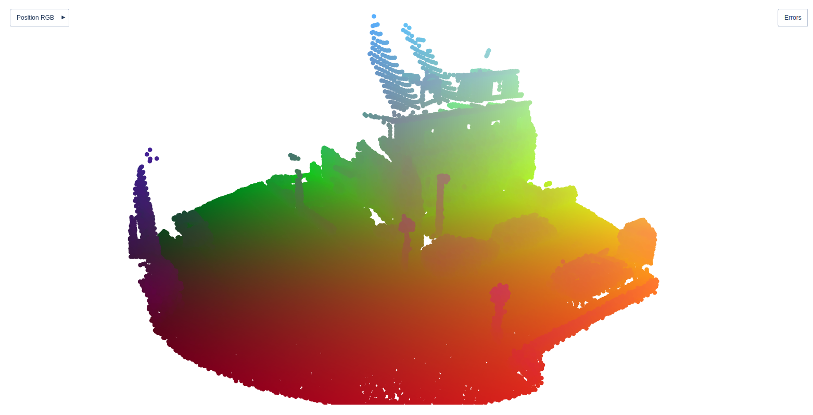
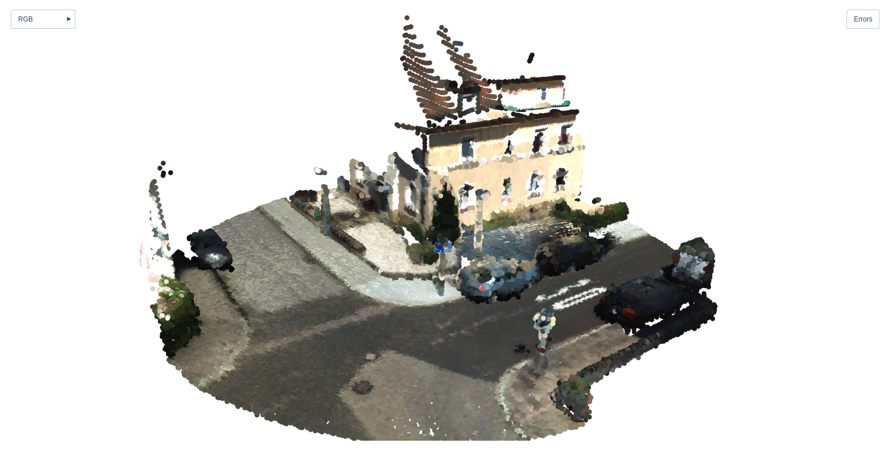
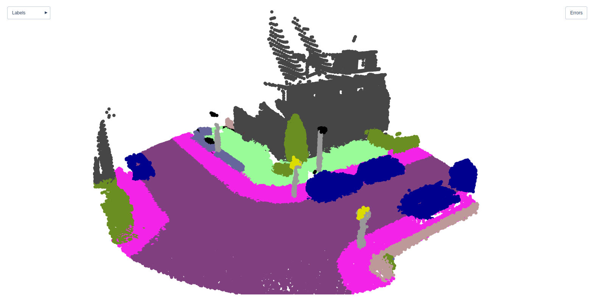
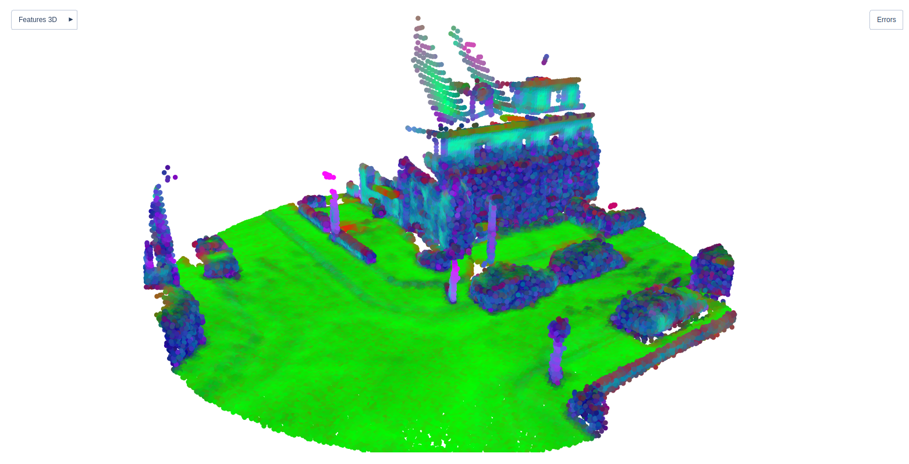
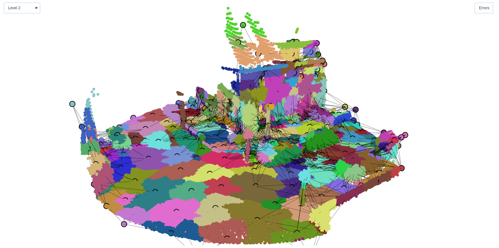
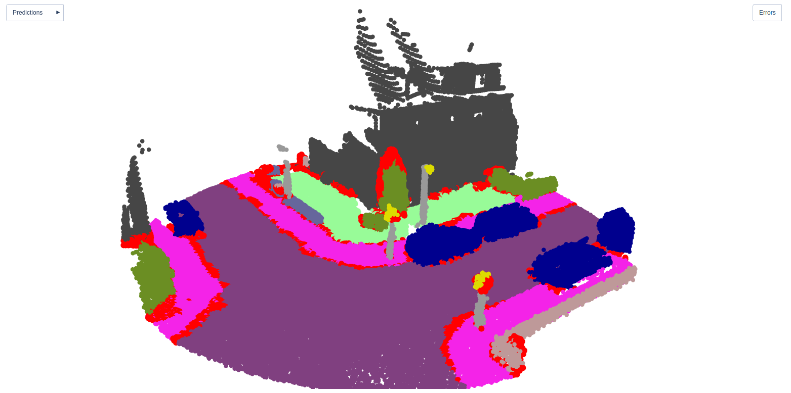
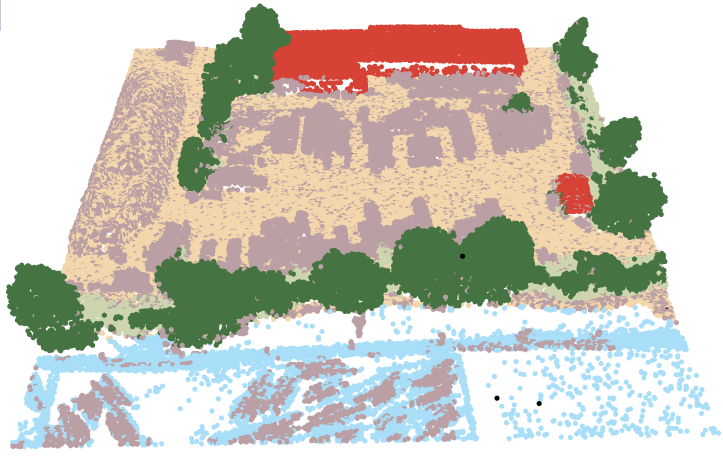
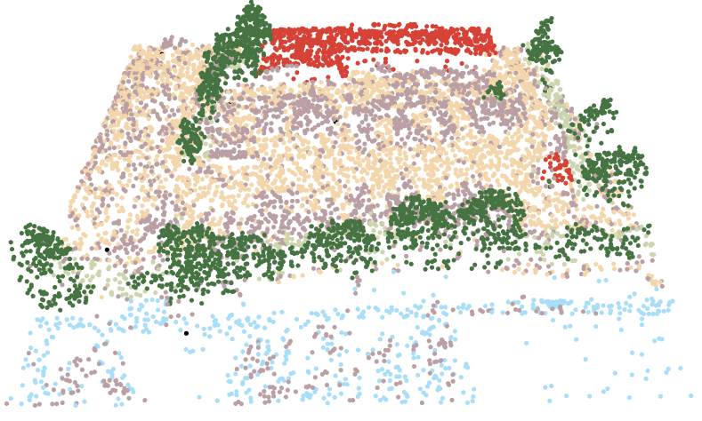
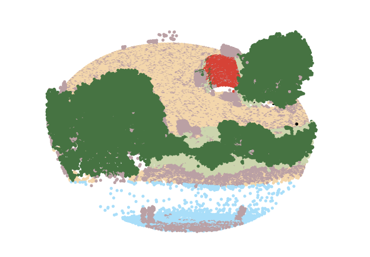
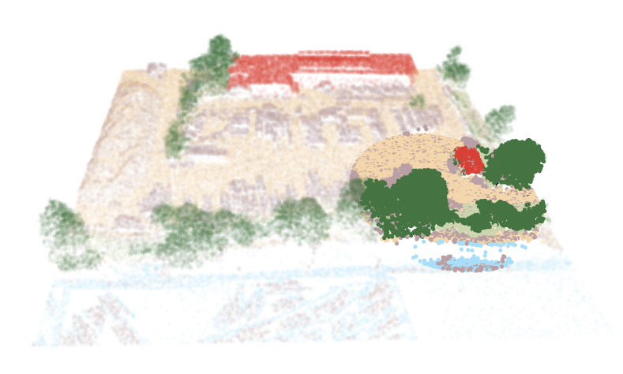

# Visualization

We provide a tool for interactive 3D visualization of `Data` and `NAG` objects. 
This allows you to inspect what your `Data` attributes look like, check whether your model's 
predictions make sense, and even share your interactive visualizations as 
simple, portable, HTML files. 

> **Note**: If you are not familiar with our `Data` and `NAG` structures yet, 
> check the [Data](docs/data_structures.md) documentation.

## Let the `show()` begin
Our `show()` function rules all visualizations. It can be used as follows:

```python
from src.visualization import show

# Visualize a Data object
show(data)
```

It is also possible to directly call `show()` as a `Data` or `NAG` method:

```python
# Visualize a Data object
data.show()

# Visualize a NAG object
nag.show()
```

Datasets inheriting from our `BaseDataset` class also have a `show_examples()` 
method that returns some spherical samples for a given class, randomly picked 
across the dataset.

```python
# Visualize `max_examples` random spherical samples of size `radius`, 
# centered on points annotated as `label`
dataset.show_examples(label, radius=4, max_examples=5)
```

## Visualizing data attributes
Given a `Data` or a `NAG` object, `show()` will automatically look for and plot 
some specific point attributes. It generates an interactive 
[Plotly](https://plotly.com/python) graph with intuitive navigation controls and
buttons for accessing different **visualization modes 🔘**.

The `pos` attribute is used to plot point positions. The 🔘`Position RGB` mode 
will display points colored with respect to their location in the scene.

<p align="center">
  
</p>

If the points carry colors in the `rgb` attribute, the 🔘`RGB` mode will display 
them.

<p align="center">
  
</p>

If the points carry semantic segmentation labels in the `y` attribute, the 
🔘`Labels` mode  will display them. In addition, `show(class_colors=..., class_names=...)` 
can be passed to adjust the color palette and the name displayed 
when mouse hovering the graph. Similarly, if the points carry panoptic 
segmentation labels in the `obj` attribute, the 🔘`Panoptic` mode will show them.
Passing `show(stuff_classes=..., num_classes=...)` allows for adjusting how
_thing_, _stuff_, and _void_ classes are displayed.

<p align="center">
  
</p>

If the points carry some features in the `x` attribute, the 🔘`Features 3D` mode
will display them. 

> **Note**: This only supports point-wise features stored as 1D or 2D 
> tensors. If the tensor contains only 1 channel, the attribute will be 
> represented with a grayscale colormap. If the tensor contains 2 or 3 channels,
> these will be represented as RGB, with an additional all-1 channel if need be.
> If the tensor contains more than 3 channels, a PCA projection to RGB will be 
> shown. In any case, the attribute values will be rescaled with respect to their
> statistics before visualization, meaning that colors may not compare between two
> different plots.

<p align="center">
  
</p>

If the points carry superpoint partition indices in the `super_index` attribute,
the 🔘`Level i` mode will display partition level `i`. Several options can be 
passed to `show()` to adjust how partitions are shown: with centroids, with 
horizontal graph edges, with vertical graph edges, with feature-colored edges, 
etc. See the
[exhaustive list of parameters of `show()`](#exhaustive-parameter-list-for-show)
for more details.

<p align="center">
  
</p>

If the points carry semantic segmentation predictions in the `semantic_pred` 
attribute, the 🔘`Semantic Pred.` mode  will display them. Besides, if both 
`semantic_pred` and `y` can be found in the input, the 🔘`Error` button can be
used to highlight the erroneous predictions, as shown in red here below. 
Similarly, `panoptic_pred` attributes can be visualized in the 
🔘`Panoptic Pred.` mode.

<p align="center">
  
</p>

> **Tip 💡**: **Want to visualize other point attributes stored in your `Data` 
> object ?** Pass them to `show(keys=...)` to have them displayed ! The same
> coloring mechanisms as mentioned above for the `x` attribute will be used.

## Points selection for visualization
Our [Plotly](https://plotly.com/python)-based visualization is mostly meant for
quick interactive experiments with up to ~10⁵ points. While it is possible to 
visualize more points at once, Plotly will take a while to generate the plot. We 
provide several tools for reducing the number of point displayed, hence 
accelerating the visualization speed.

Say you have the following large-scale visualization.

<p align="center">
  
</p>

You can choose to alleviate the visualization time by sampling some points.
This can be done in one of two ways:

- random sampling with respect to a maximum point budget with:
```python
show(max_points=...)
```

- grid sampling (ie voxelization) with:
```python
show(voxel=...)
```

This can make your visualization run faster, at the expense of resolution.

<p align="center">
  
</p>

Another strategy is to simply visualize a smaller area. To this end, one can 
visualize only a spherical crop of the scene with:
```python
show(radius=..., center=...)
```

<p align="center">
  
</p>

We also provide a tool for displaying point selections with: 
```python
show(select=..., alpha=...)
```

This internally calls `NAG.select()` and `Data.select()` and applies an
`alpha` opacity to the non-selected points. This is typically useful for 
visualizing binary masks across the scene. Here is, for example, the mask
corresponding to the previous spherical cropping operation.

<p align="center">
  
</p>

## Sharing your visualization as an HTML
You can export your Plotly figure as an HTML file which can be conveniently
opened by virtually anyone with a browser. To this end, simply specify a `path` 
to which your HTML should be saved, along with a figure `title`, if need be: 
```python
show(path=..., title=...)
```


## Exhaustive parameter list for `show()`
Here is the list of supported parameters for `show()`:

| Parameter         |            Type             | Description                                                                                                                                                                                                                                                                                                                                                                                                                           |
|:------------------|:---------------------------:|:--------------------------------------------------------------------------------------------------------------------------------------------------------------------------------------------------------------------------------------------------------------------------------------------------------------------------------------------------------------------------------------------------------------------------------------|
| `input`           |       `Data` or `NAG`       | `Data` or `NAG` object to visualize                                                                                                                                                                                                                                                                                                                                                                                                   |
| `keys`            |    `List(str)` or `str`     | By default, the following attributes will be parsed in `input` for visualization {`pos`, `rgb`, `y`, `obj`, `semantic_pred`, `obj_pred`}. Yet, if `input` contains other attributes that you want to visualize, these can be passed as `keys`. This only supports point-wise attributes stored as 1D or 2D tensors. If the tensor contains only 1 channel, the attribute will be represented with a grayscale colormap. If the tensor |contains 2 or 3 channels, these will be represented as RGB, with an additional all-1 channel if need be. If the tensor contains more than 3 channels, a PCA projection to RGB will be shown. In any case, the attribute values will be rescaled with respect to their statistics before visualization, meaning that colors may not compare between two different plots |
| `figsize`         |            `int`            | Figure dimensions will be `(figsize, figsize/2)` if `width` and `height` are not specified                                                                                                                                                                                                                                                                                                                                            |
| `width`           |            `int`            | Figure width                                                                                                                                                                                                                                                                                                                                                                                                                          |
| `height`          |            `int`            | Figure height                                                                                                                                                                                                                                                                                                                                                                                                                         |
| `class_names`     |         `List(str)`         | Names for point labels found in attributes `y` and `semantic_pred`                                                                                                                                                                                                                                                                                                                                                                    |
| `class_colors`    | `List(List(int, int, int))` | Colors palette for point labels found in attributes `y` and `semantic_pred`                                                                                                                                                                                                                                                                                                                                                           |
| `stuff_classes`   |         `List(int)`         | Semantic labels of the classes considered as `stuff` for instance and panoptic segmentation. If `y` and `obj` are found in the point attributes, the stuff annotations will appear accordingly. Otherwise, stuff instance labeling will appear as any other object                                                                                                                                                                    |
| `num_classes`     |            `int`            | Number of valid classes. By convention, we assume `y ∈ [0, num_classes-1]` are VALID LABELS, while `y < 0` AND `y >= num_classes` ARE VOID LABELS                                                                                                                                                                                                                                                                                     |
| `hide_void_pred`  |           `bool`            | Whether predictions on points labeled as VOID be visualized                                                                                                                                                                                                                                                                                                                                                                           |
| `voxel`           |           `float`           | Voxel size to subsample the point cloud to facilitate visualization                                                                                                                                                                                                                                                                                                                                                                   |
| `max_points`      |            `int`            | Maximum number of points displayed to facilitate visualization                                                                                                                                                                                                                                                                                                                                                                        |
| `point_size`      |      `int` or `float`       | Size of point markers                                                                                                                                                                                                                                                                                                                                                                                                                 |
| `centroid_size`   |      `int` or `float`       | Size of superpoint markers                                                                                                                                                                                                                                                                                                                                                                                                            |
| `error_color`     |    `List(int, int, int)`    | Color used to identify mis-predicted points                                                                                                                                                                                                                                                                                                                                                                                           |
| `centroids`       |           `bool`            | Whether superpoint centroids should be displayed                                                                                                                                                                                                                                                                                                                                                                                      |
| `h_edge`          |           `bool`            | Whether horizontal edges should be displayed (only if `centroids=True`)                                                                                                                                                                                                                                                                                                                                                               |
| `h_edge_attr`     |           `bool`            | Whether the edges should be colored by their features found in `edge_attr` (only if `h_edge=True`)                                                                                                                                                                                                                                                                                                                                    |
| `h_edge_width`    |           `float`           | Width of the horizontal edges, if `h_edge=True`. Defaults to `None`, in which case `point_size` will be used for the edge width                                                                                                                                                                                                                                                                                                       |
| `v_edge`          |           `bool`            | Whether vertical edges should be displayed (only if `centroids=True` and `gap` is not `None`)                                                                                                                                                                                                                                                                                                                                         |
| `v_edge_width`    |           `float`           | Width of the vertical edges, if `v_edge=True`. Defaults to `None`, in which case `point_size` will be used for the edge width                                                                                                                                                                                                                                                                                                         |
| `gap`             | `List(float, float, float)` | If `None`, the hierarchical graphs will be overlaid on the points. If not `None`, a 3D tensor indicating the offset by which the hierarchical graphs should be plotted                                                                                                                                                                                                                                                                |
| `radius`          |           `float`           | If not `None`, only visualize a spherical sampling of the input data, centered on `center` and with size `radius`. This option is not compatible with `select`                                                                                                                                                                                                                                                                        |
| `center`          | `List(float, float, float)` | If `radius` is provided, only visualize a spherical sampling of the input data, centered on `center` and with size `radius`. If `None`, the center of the scene will be used                                                                                                                                                                                                                                                          |
| `select`          |    `Tuple(int, Tensor)`     | If not `None`, will call `Data.select(*select)` or `NAG.select(*select)` on the input data (depending on its nature) and the coloring schemes will illustrate it. This option is not compatible with `radius`                                                                                                                                                                                                                         |
| `alpha`           |           `float`           | Rules the whitening of selected points, nodes and edges (only if  select is not `None`)                                                                                                                                                                                                                                                                                                                                               |
| `alpha_super`     |           `float`           | Rules the whitening of superpoints (only if select is not `None`). If `None`, alpha will be used as fallback                                                                                                                                                                                                                                                                                                                          |
| `alpha_stuff`     |           `float`           | Rules the whitening of stuff points (only if the input points have `obj` and `semantic_pred` attributes, and `stuff_classes` or `num_classes` is specified). If `None`, `alpha` will be used as fallback                                                                                                                                                                                                                              |
| `point_symbol`    |            `str`            | Marker symbol used for points. Must be one of `{'circle', 'circle-open', 'square', 'square-open', 'diamond', 'diamond-open', 'cross', 'x'}`. Defaults to `'circle'`                                                                                                                                                                                                                                                                   |
| `centroid_symbol` |            `str`            | Marker symbol used for centroids. Must be one of `{'circle', 'circle-open', 'square', 'square-open', 'diamond', 'diamond-open', 'cross', 'x'}`. Defaults to `'circle'`                                                                                                                                                                                                                                                                |
| `colorscale`      |            `str`            | Plotly colorscale used for coloring 1D continuous features. See https://plotly.com/python/builtin-colorscales for options                                                                                                                                                                                                                                                                                                             |
| `path`            | `str` | If not `None`, `path` will be used for storing the Plotly figure as an HTML file                                                                                                                                                                                                                                                                                                                                                      |
| `title`           | `str` | Title for the Plotly figure                                                                                                                                                                                                                                                                                                                                                                                                           |
| `pt_path` | `str` | Path to save the visualization-ready `Data` object as a `*.pt`. In this `Data` object, the `pos` and all `*color*` attributes will be saved, the rest is discarded. This is typically useful for exporting the visualization layers to another visualization tool                                                                                                                                                                     |
| `kwargs`          |                             |                                                                                                                                                                                                                                                                                                                                                                                                                                       | 


## 🚀  Getting started with visualization
See the [`notebooks/demo_nag.ipynb`](../notebooks/demo_nag.ipynb) notebook to play with our visualization tool 
on a provided `NAG`, without needing a whole dataset.

For more information, have a look at the code in `src.visualization`, it is
fairly commented and should help you gain a deeper understanding of the 
visualization mechanisms.
